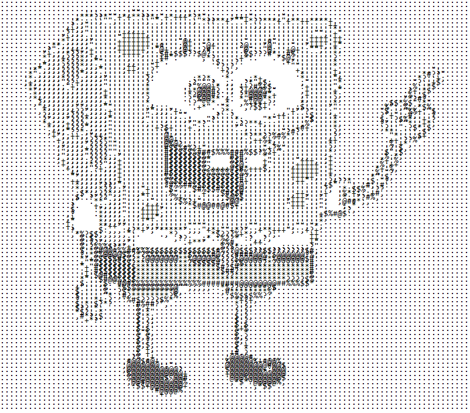

# PHP Image 2 ASCII converter

## Usage
```
$img2Ascii = new Img2Ascii();
$img2Ascii->setImageFile(__DIR__ . "/example.jpg");
$img2Ascii->write();
```

### Getting the result as return variable 
```
$img2Ascii->get();
```

### Writing to a stream (like an open file resource)
```
$outputStream = fopen("php://output", "a+");
$img2Ascii->toStream($outputStream);
```

### Processing the characters and newlines from userland code
```
$img2Ascii->callback(
    function (string $char)
    {
        echo htmlentities($char);
    },
    function ()
    {
        echo "<br />";
    });
```

### Changing Character set
```
$img2Ascii->setChars('@#%$?*+";:,. ');
```

### Blocksize
When you don't want each pixel to be translated into a character, but want to collect the brightness of a rectangle
(so-called "block"), set it with `setBlockSize()`. This reduces the width and height of the resulting ascii image.
```
$img2Ascii->setBlockSize(4);
```


### Using Mutibyte Characters
```
$img2Ascii->setChars('█▓▒░ ', true);
// or
$img2Ascii->setChars('█▓▒░ ');
$img2Ascii->multibyte();
```


## Examples

http://localhost/?s=0&img=spongebob

http://localhost/?s=1&img=spongebob

http://localhost/?s=2&img=spongebob

http://localhost/?s=3&img=spongebob


Example result



```..................................................
.........,...,:,...,,.............................
........+"+""""++"""++";;++";"";:;;,..............
.......";;:::::::::::::::::::::::::+..............
......,";;::;++":::::::::::::::::"+;:.............
.....:";;"::"+++;":?";*::;+:?;:;;++":.............
....,+;++"::;++;;%"?+?+::;$"$"+?:;:",.............
....;;"?*;":::::;+,  ."":":. ,*;:::"..............
...:";+?*;;::"":"      ;".     ;:::"..........:...
...+;;+?+;;;:::".   .;:.; .;.  ."::;:.......,*+:..
..,";;;*;;;;:::"   .+??::,*?*.  ;::;;.......*;+...
...+;;;;;;;":::"   ,*@@;:;$@?:  ;::":......";+....
...:";;;;;;":::".  .+??,;:?$*.  "::+.....:;?*"....
....";;;+;;":::;";:..:,;; :", ,;+::"....,*:***:...
....;;;+?";":::;:::;..;;;: .:;;:;+:"....""+?:;;...
....:";*?;;;::::;+;:"+;::"+":::;?;:"....:";+++....
.....;;"+;";:::::*;:::::::""+***:::+.....";:""....
......;;;+?+;::::*%":::::::"*;:::::+.....;;+;.....
......;;;*?+;::::*$%$?****++*?;::::;.....++.......
......";;+?+"::::*$$$%: +%. +::;";::....:"+.......
......,;;"*;"::::*$$$%":*%;:+::+++:;....+",.......
.......:;;;;"::::*$$$$%%%%+::::++":;...:"+........
.......:";;+"::::+%%%$$$$#;::::;;:;*;;.*+:........
........+"+?;;:+:;*:"?+?%%:::::;;:"."+*;*.........
........;:*";;:;;:"*";::$$::::;++:; +*++..........
.......;. ;;;;:++;::+???*;:::::";:; ,;............
......."  ;;;;:++:::::::::::::::::+++.............
......."  ;";;:;;:::;;::::;;:::;;":...............
.......;""+,,;"::;*;,:"**?;:+;:,:*................
........"+",,:,   .;;;,"$::;:    +................
........""%#$?*""""""""???+""""++*................
........;"%##$?%###*%#@$?#@@$#@@%*................
........:"%$$$?????*???%?$??*???*+................
........,"%$$$?********?$********+................
........":"?$#$$$$$$$$$$$$%%%$$$$;................
........+::";$$$$$%:,,,;$?**?;....................
........+:"+,?$???*.....:??":.....................
........*"*;..+?+,......."+.......................
........**+..."":........+".......................
.........;:..."+,........+".......................
.............."*,........+".......................
.............."".........*;.......................
.............."".........";.......................
..............*:,.......+$?.......................
.............*@##,,.....@@@%@@:...................
.............+@@@@@*....%@@@?@*...................
.............;@@@@##...."%$@@@:...................
..............:;%@@*.......,",....................
.................;;...............................
..................................................
```

## License
There is no such thing. Use it as you'd like, change it, or rewrite it completely.
And feel free to drop me a mail at [developer@horvathpeter.eu](mailto:developer@horvathpeter.eu?subject=img2ascii)
